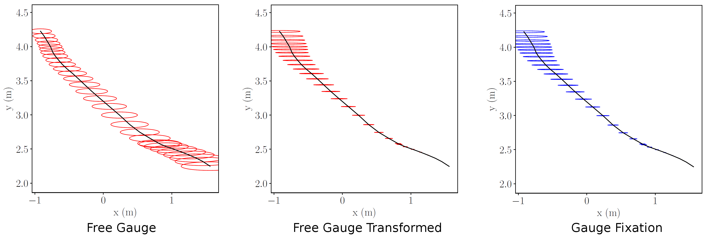
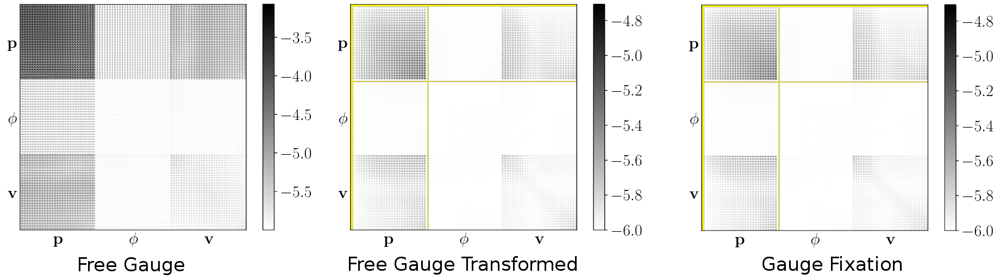

# Covariance Transformation for Visual-Inertial Systems

This repository contains the implementation of the covariance transformation method in the following publication:

Zichao Zhang, Guillermo Gallego and Davide Scaramuzza, "*On the Comparison of Gauge Freedom Handling in Optimization-Based Visual-Inertial State Estimation*," in IEEE Robotics and Automation Letters, vol. 3, no. 3, pp. 2710-2717, July 2018.

If the code is used, please cite:

```latex
@inproceedings{Zhang18ral,
  author={Zichao Zhang and Guillermo Gallego and Davide Scaramuzza},
  journal={IEEE Robotics and Automation Letters},
  title={On the Comparison of Gauge Freedom Handling in Optimization-Based Visual-Inertial State Estimation},
  year={2018},
  month={July}
  }
```

## Handling unobservable degrees of freedom

It is well known that visual-inertial systems have four degrees of freedom that are not observable: the global position and the rotation around gravity. These unobservable degrees of freedom (called *gauge freedom*) have to be handled properly in visual-inertial state estimation to obtain a unique state estimate. In optimization-based methods, three approaches are usually used:

* *Gauge Fixation*: fixing the initial state,
* *Gauge Prior*: adding a prior to the initial state,
* *Free Gauge*: allowing the parameters to evolve freely during optimization.


While these three methods do not have significant differences in terms of accuracy and efficiency, the estimated covariance (inverse/pseudo inverse of the Fisher Information Matrix) can be very different. The following figure shows the estimated position uncertainties using fixation (left) and free gauge method (right). 

**Position uncertainties of different methods**



While the estimated covariance from the gauge fixation method shows that the uncertainty grows over time (time increases from bottom to top), the uncertainties from the free gauge approach cannot be interpreted intuitively. This is due to the fact that no reference is chosen for the free gauge approach, and therefore the uncertainty is not associated with any reference frame. However, we show that by observing the gauge constraint, we can *transform the estimated covariance from the free gauge method to any desired gauge fixation*. The result is shown in the middle plot, where we can see that the transformed free gauge uncertainties agree very well with the ones from the gauge fixation case.

Such transformations can be useful, for example, when the optimization process is used as a black box, and the covariance of a certain fixation is desired. We publicly release the code to the community to benefit related research. 


**Covariance matrices of different methods**

The following figure shows how the covariance matrix (in position `p`, orientation `phi` and velocity `v` of the camera) from the free gauge method is transformed to a desired gauge, that is, to a desired reference frame. The yellow areas denote fixed parameters.




## Instructions to Run the Code
Simply run

```python
python2 compare_cov_free_fixed.py
```

The transformed covariance/uncertainties will be plotted and saved in `plots`.

The script calls the function in `cov_transformation.py` to transform the free gauge covariance to the gauge fixation case. We provide several example datasets in `data` folder. You can try different ones by changing the code at the beginning of the script `cov_transformation.py`.

The covariance transformation method is implemented in `cov_transformation.py`, and it does not depend on our data and its format. Please see the documentation there for details (e.g., input and output).

